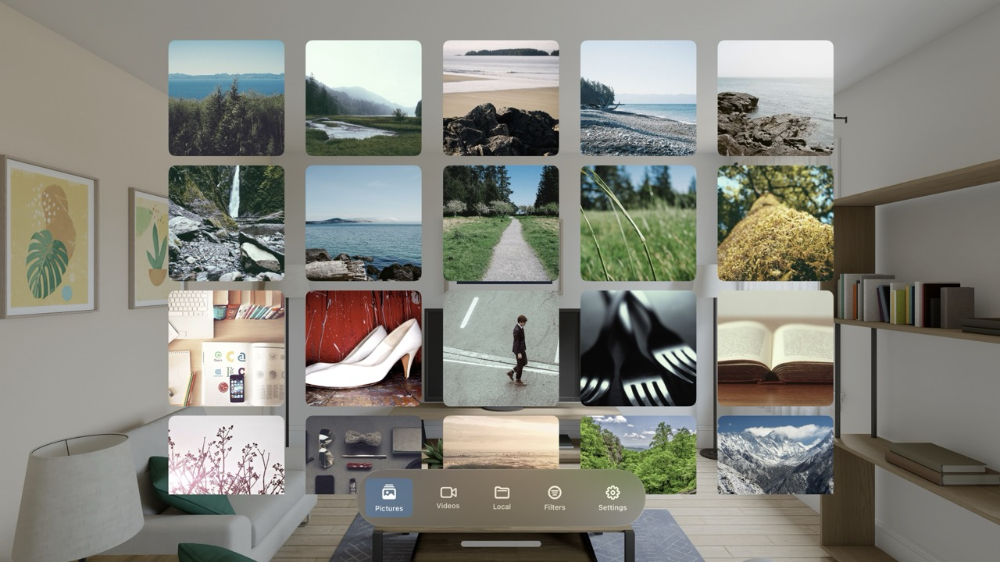
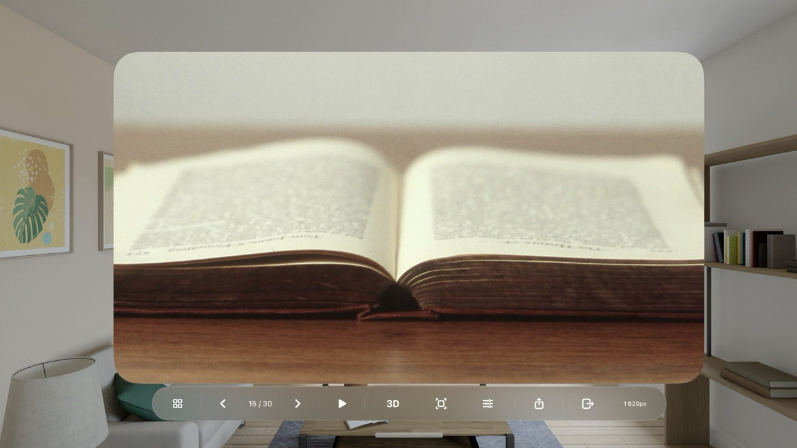
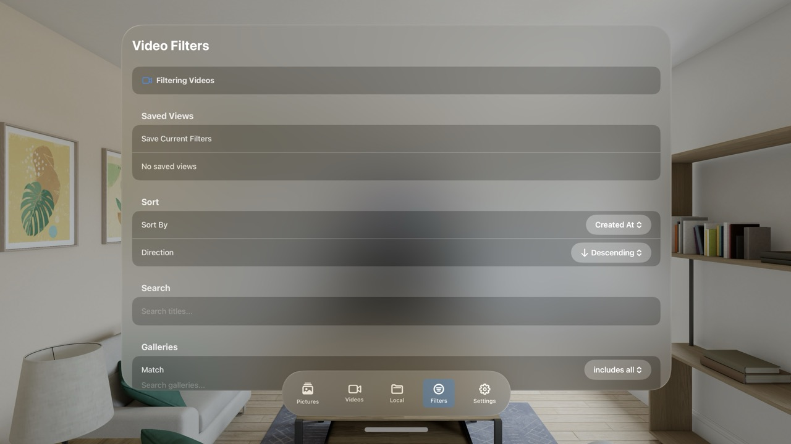
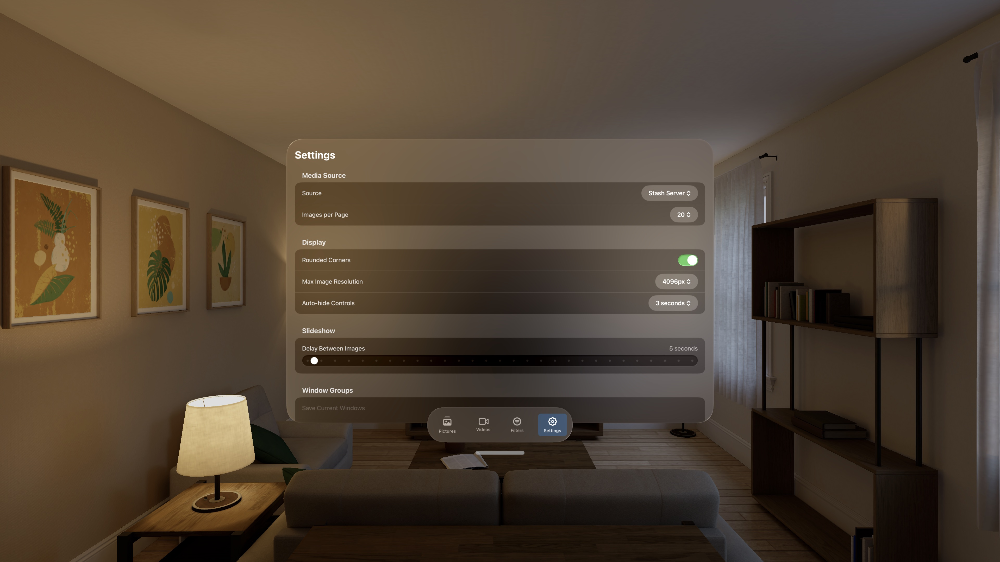

# Spatial Stash

A visionOS app for Apple Vision Pro that transforms your 2D images into immersive 3D spatial photos. Browse your media library from a [Stash](https://github.com/stashapp/stash) server or use the built-in demo mode.

## Features

- **2D to 3D Conversion** - Uses Apple's RealityKit to convert standard images into spatial 3D photos viewable on Vision Pro
- **Stash Server Integration** - Connect to your Stash media server via GraphQL API to browse images and videos
- **Advanced Filtering** - Filter by galleries, tags, ratings, and O-count with saved filter presets
- **Video Playback** - Stream videos directly from your Stash server
- **VR Video Support** - View VR videos in side-by-side or over-under formats, configurable via tags or in-app settings
- **Unlimited Windows** - Open multiple image viewer windows that persist in your space, you can even use pictures as virtual decorations
- **Demo Mode** - Try the app with bundled sample images without server setup

## Screenshots






## Requirements

- Apple Vision Pro or visionOS Simulator
- Xcode 15.0+
- visionOS 26.0+
- (Optional) [Stash](https://github.com/stashapp/stash) server for media library integration

## Installation

1. Clone the repository:
   ```bash
   git clone https://github.com/illixion/spatialstash.git
   cd spatialstash
   ```

2. Open the project in Xcode:
   ```bash
   open SpatialStash/SpatialStash.xcodeproj
   ```

3. Select your development team in Xcode (Project → Signing & Capabilities)

4. Build and run on visionOS Simulator or device (Cmd+R)

## Configuration

### Demo Mode
The app starts in demo mode with sample images. No configuration required.

### Stash Server
To connect to your Stash server:

1. Open the app and navigate to the **Settings** tab
2. Change **Media Source** to "Stash Server"
3. Enter your Stash server URL (e.g., `http://192.168.1.100:9999`)
4. Enter your API key if authentication is enabled
5. Tap **Apply & Test Connection**

## Usage

### Pictures Tab
Browse your image gallery in a grid view. Tap any image to view it full-screen with spatial 3D conversion:
- Use the bottom ornament controls to navigate between images
- Tap the 3D button to generate a spatial 3D version of the current image
- The window automatically adjusts to match image aspect ratios

### Videos Tab
Browse and play videos from your Stash server with standard playback controls.

### Filters Tab
Create complex queries to filter your media (Stash server only):
- Search by title
- Filter by galleries and tags
- Filter by rating (1-5 stars) or O-count
- Sort by date, title, rating, or random
- Save filter combinations as presets for quick access or as default views

### Settings Tab
Configure your media source and server connection. View statistics about loaded content.

## Architecture

The app follows a SwiftUI architecture with:
- `AppModel` - Central `@Observable` state container
- Protocol-based data sources (`ImageSource`, `VideoSource`) for swappable implementations
- `StashAPIClient` actor for thread-safe GraphQL communication
- RealityKit integration via `ImagePresentationComponent` for spatial photos

## License

See [LICENSE.txt](LICENSE.txt) for licensing information.

## Acknowledgments

- [Stash](https://github.com/stashapp/stash) - Self-hosted media organizer
- Built with Apple's RealityKit and SwiftUI frameworks
