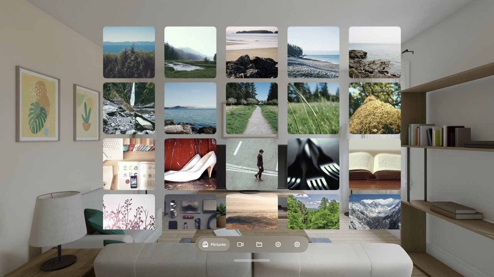
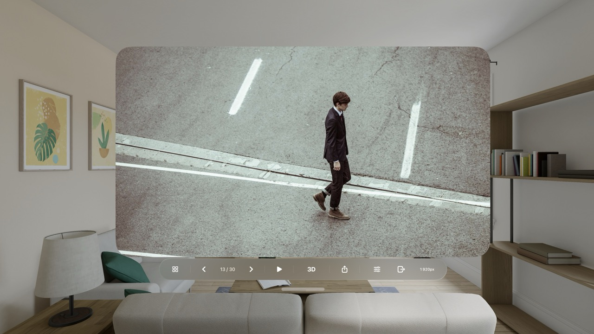
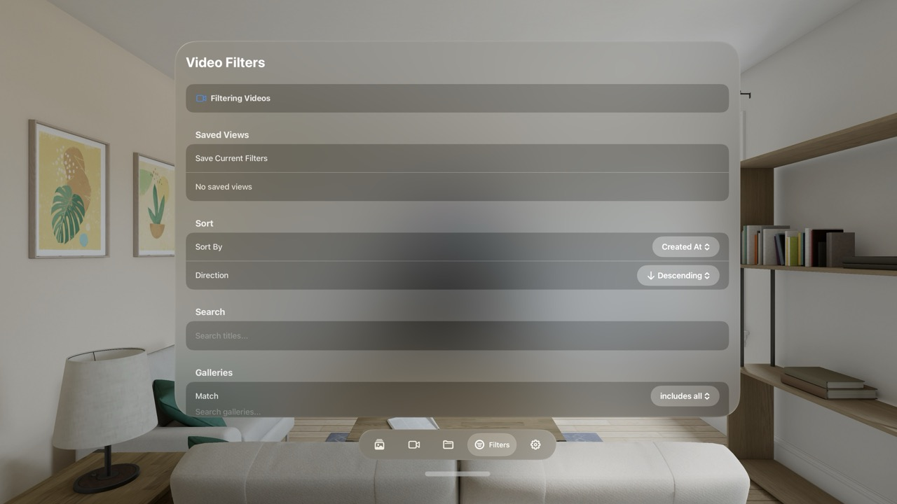
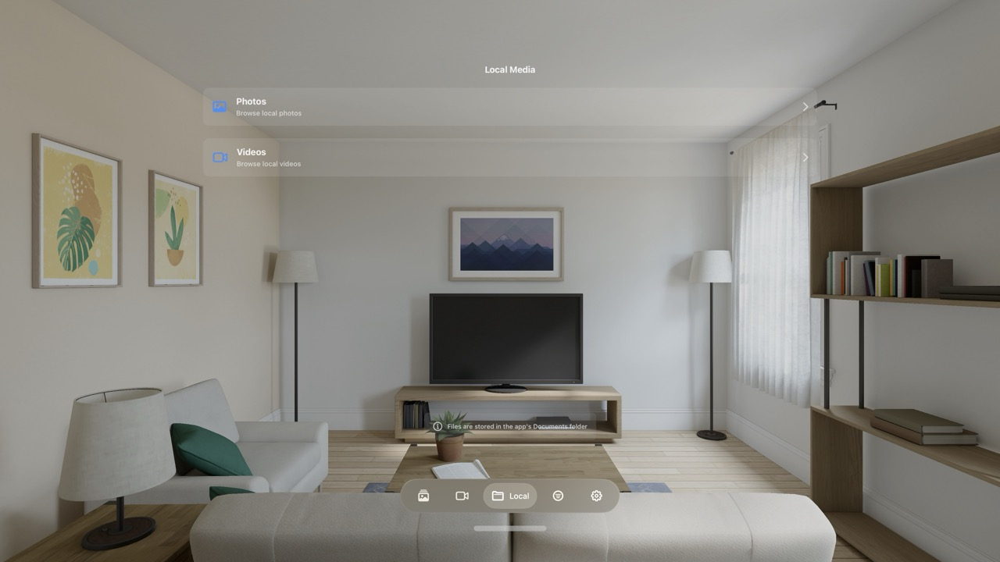
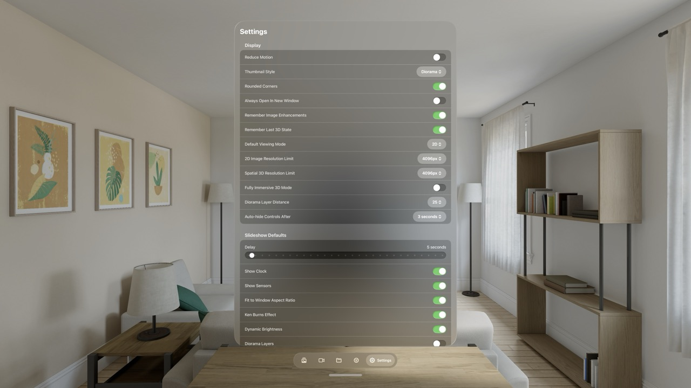

# Hypnos

A visionOS app for Apple Vision Pro that transforms your 2D images into immersive 3D spatial photos, with an iPhone and iPad version of the same app. Browse your media library from a [Stash](https://github.com/stashapp/stash) server, your photo library, local files, or use the built-in demo mode.

The one project builds for both platforms. Everything that isn't about depth — the galleries, filters, slideshows, video playback, enhancements, background removal, the RoboFrame viewer, pinned web pages, settings backup — runs on iOS too. What stays Vision Pro-only is what needs a stereoscopic display or several windows: spatial 3D photo conversion, immersive 3D, pseudo-3D and MV-HEVC video, diorama layers, and the window manager. See [Platforms](#platforms).

## Features

- **2D to 3D Conversion** - Uses Apple's RealityKit to convert standard images into spatial 3D photos viewable on Vision Pro, with automatic restoration of 3D state for previously converted images
- **Stash Server Integration** - Connect to your Stash media server via GraphQL API to browse images and videos
- **Local Files** - Browse images and videos from the app's Documents folder
- **Share Sheet Support** - Receive images and videos from other apps via the system share sheet, with save-to-files option
- **Advanced Filtering** - Filter by galleries, tags, ratings, performers and more with saved filter presets
- **Swipe Navigation** - Swipe between images in the gallery with smooth transitions
- **Slideshow** - Random image/video slideshow with Ken Burns animation, dynamic brightness, clock overlay, and visual adjustments. Local gallery and app-gallery playback uses the shared `RAVESlideshow` lifecycle/provider/synchronization package; RoboFrame playback remains server-driven in the legacy Remote product until the dedicated client completes parity. Launches in a dedicated viewer window with configurable display options
- **Rating & O-Count** - View and edit image ratings and O-count directly from the viewer
- **Video Playback** - Stream videos directly from your Stash server or play local files
- **Stereoscopic 3D Video** - Automatically detects SBS/OU stereoscopic formats from tags, converts to MV-HEVC, and plays in full immersive mode
- **Pseudo 3D Video Conversion** - Converts flat videos into windowed stereoscopic 3D using Core ML monocular depth (Depth Anything V2). Choose between **real-time** (instant, 30fps inference-bound) or **pre-processed** (background conversion for exact-frame 60fps playback with offline-optimized depth quality). Adjustable depth strength, convergence, and Subtle/Medium/Strong presets. Models downloaded on-demand from Apple's Hugging Face repo, switchable and deletable from the view-mode menu. With "Real-Time 3D for All Videos" enabled in Settings, eligible videos auto-engage 3D on open
- **Unlimited Windows** - Open multiple image viewer windows that persist in your space
- **Memory Management** - Lightweight 2D display by default with automatic downsampling, configurable dynamic image resolution, and memory-aware window management
- **Demo Mode** - Try the app with bundled sample images without server setup

## Screenshots







## Requirements

- Apple Vision Pro or visionOS Simulator, **or** an iPhone/iPad or iOS Simulator
- Xcode 26+
- visionOS 26.0+ / iOS 26.0+
- (Optional) [Stash](https://github.com/stashapp/stash) server for media library integration

## Platforms

Hypnos is one target with two platforms. The scene graph is the only
thing that differs: visionOS opens a window per viewer plus two immersive
spaces; iOS has a single window in which the same viewers open as full-screen
covers and the tool windows as sheets (`IOSWindowRouter`). Everything below the
scene roots is shared code.

| Feature | visionOS | iOS / iPadOS |
|---|---|---|
| Photos, Stash and Local libraries, albums, filters, multi-select | ✓ | ✓ |
| Photo viewer: Metal 2D display, swipe navigation, animated GIF/WebP/JXL, adjustments, auto-enhance, background removal, flip, share, info/edit | ✓ | ✓ |
| Video: native Metal and WebKit players, custom transport, A-B loop, Stash transcode fallback, adjustments | ✓ | ✓ |
| Slideshows (gallery and RoboFrame), Ken Burns, clock/sensor overlays, WebSocket control, Display Sync | ✓ | ✓ |
| Pinned web pages, `hypnos://play` handoff, web-yt-dlp | ✓ | ✓ |
| Settings backup/import, disk cache manager, debug console | ✓ | ✓ |
| Spatial 3D photo conversion, Immersive 3D, Quick Look in 3D | ✓ | — needs a stereoscopic display |
| Pseudo-3D and MV-HEVC immersive video, depth models | ✓ | — |
| Diorama layers and diorama thumbnails | ✓ | — depth axis only |
| Multiple windows, Windows tab, saved window groups, "open in new window" | ✓ | — one window; iPad can still open several app instances |

Build for iOS from the command line with:

```bash
xcodebuild -quiet -project Hypnos/Hypnos.xcodeproj -scheme Hypnos \
  -destination 'generic/platform=iOS Simulator' build CODE_SIGNING_ALLOWED=NO
```

## Dependencies

Hypnos links two shared packages:

| Package | Products used |
|---|---|
| [`RAVESDK`](https://github.com/illixion/RAVESDK) | `RAVENet`, `RAVEUI`, `RAVEConsole`, `RAVEMedia` |
| [`RAVEEngine`](https://github.com/illixion/RAVEEngine) | `RAVEDiagnostics` |

Both are referenced as **local** Swift packages by relative path —
`../../RAVESDK` and `../../RAVEEngine`, resolved against the directory holding
`Hypnos.xcodeproj` — not as versioned remote dependencies. So a clone does
not fetch them: check them out as **siblings** of this repo, which is what step 1
below does.

The requirement is only that this repo's parent directory also contains
directories named exactly `RAVESDK` and `RAVEEngine`; this repo's own directory
name does not matter. Get it wrong and Xcode fails at package resolution, before
compiling anything.

Why path references and not versions: the packages and the apps co-evolve
continuously — several of these targets arrived in the packages by being lifted
out of this app — and a path reference keeps "move this into the package and
update its callers" a single atomic edit.

## Installation

1. Clone this repository and both packages into the same parent directory:
   ```bash
   git clone https://github.com/illixion/spatialstash.git
   git clone https://github.com/illixion/RAVESDK.git
   git clone https://github.com/illixion/RAVEEngine.git
   ```
   giving you:
   ```
   some-parent/
   ├── RAVESDK/
   ├── RAVEEngine/
   └── spatialstash/
   ```

2. Open the project in Xcode:
   ```bash
   cd spatialstash
   open Hypnos/Hypnos.xcodeproj
   ```

3. Select your development team in Xcode (Project → Signing & Capabilities)

4. Pick a visionOS or iOS run destination and build and run (Cmd+R)

## Configuration

### Demo Mode
The app starts in demo mode with sample images. No configuration required.

### Stash Server
To connect to your Stash server:

1. Open the app and navigate to the **Settings** tab
2. Change **Media Source** to "Stash Server"
3. Enter your Stash server URL (e.g., `http://192.168.1.100:9999`)
4. Enter your API key if authentication is enabled
5. Tap **Apply & Test Connection**

### Local Files
To use local files:

1. Change **Media Source** to "Local Files"
2. Place images in the app's Documents/Photos/ folder and videos in Documents/Videos/
3. Tap **Refresh All Content** to scan for new files

## Usage

### Pictures Tab
Browse your image gallery in a grid view. Tap any image to open it in the viewer:
- **Swipe** left/right to navigate between images
- Tap the **2D/3D** button to generate a spatial 3D version and toggle it on/off (3D generation may take a few seconds)
- Tap the **person outline** button to toggle background removal
- Tap the **play** button to launch a slideshow viewer with Ken Burns animation, clock overlay, and visual adjustment controls
- Tap the **star** button to view/edit rating and O-count (Stash server only)
- Tap the **pop-out** button to open the image in its own window
- Images previously viewed in 3D show a "Restore 3D" prompt pill that opts you back in with one tap (auto-dismisses after 10s)
- The window automatically adjusts to match image aspect ratios

### Videos Tab
Browse and play videos. Tap the **view-mode** button in the ornament to switch between flat **2D**, **Pseudo 3D** (2D→3D conversion), and (for tagged SBS/OU sources) full immersive **Stereoscopic 3D**:

#### Pseudo 3D Conversion
Converts any flat video into windowed stereoscopic 3D using **Core ML monocular depth** (Depth Anything V2):
- **Real-Time mode** - Instant, 30fps
- **Pre-Processed mode** - Background conversion for 60fps cached playback: downloads a low-res copy of your video, infers depth for every frame offline, applies advanced filtering and temporal smoothing, and caches the depth in a compact HEVC sidecar. You can watch the video in 2D while the conversion runs in the background, then switch to 3D playback once it's ready (or let it auto-engage mid-conversion). Future plays use the cached depth at full framerate with zero ANE load. Conversion time is ~0.5–1× realtime depending on video length and your system
  - The first time you access 3D conversion, a setup sheet lets you download a depth model on-demand — straight from Apple's Hugging Face repo, ~19–50 MB depending on the variant (Depth Anything V2 Small in F16, INT8, 6-bit, or 8-bit palettized; larger variants yield better depth quality)
  - Installed models can be switched, deleted, or supplemented with your own custom model via `scripts/convert-depth-model.py`
  - Both **Depth Model (Real-Time)** and **Depth Model (Pre-Process)** submenus appear in the view-mode menu, letting you pick the model for each pipeline without visiting Settings (real-time model changes apply to the playing video immediately; pre-process model applies to future conversions and cache lookups)
- Pick Subtle/Medium/Strong depth presets from the menu, and fine-tune **Stereo Separation**, **Convergence**, and (in pre-process) **Auto Convergence** in the Adjustments window (which opens as its own repositionable window so it never sits behind the 3D video)
- Settings → Display → "Real-Time 3D for All Videos" enables auto-engagement: eligible videos (native-Metal playable, not genuinely stereoscopic) open with Pseudo 3D already engaged — prefers the cached pre-process depth when available, otherwise uses real-time inference

#### Stereoscopic 3D
Videos automatically detected from Stash tags (SBS/Over-Under format) are converted to MV-HEVC and play in full immersive mode.

#### Playback
- Custom control bar (play/pause, scrubber with buffered range, A-B loop, mute) for flat 2D videos
- In Pseudo 3D mode, transport controls fold into the ornament so all chrome shares the video's depth plane
- Full window aspect ratio locking ensures videos maintain their proper proportions

### Filters Tab
Create complex queries to filter your media (Stash server only):
- Search by title
- Filter by galleries, performers, studios, tags
- Filter by rating (1-5 stars) or O-count
- Sort by date, title, rating, or random
- Save filter combinations as presets for quick access or as default views

### Settings Tab
- **Media Source** - Switch between Demo, Stash Server, and Local Files
- **Dynamic Image Resolution** - Toggle automatic image downsampling based on window size (on by default, turn off for full-resolution display)
- **Auto-hide Controls** - Configure how long ornament controls stay visible
- **Slideshow Delay** - Set the interval between slideshow images
- **Real-Time 3D Depth Model** / **Pre-Process 3D Depth Model** - Select which installed monocular depth model each pipeline uses. Models are downloaded on-demand from Apple's Hugging Face repo (~19–50 MB each) and stored internally. Real-time model changes apply immediately to the playing video; pre-process model changes apply to future conversions. Switched or deleted via the view-mode menu or these Display settings
- **Real-Time 3D for All Videos** - When enabled, eligible videos (native-Metal playable) auto-engage Pseudo 3D on open, using cached pre-processed depth when available or real-time inference otherwise
- **3D Depth Model Manager** (Developer) - Download, switch between, or delete the monocular depth models. Models are fetched directly from Apple's Hugging Face repo and stored internally; a custom model pushed to the app's Documents folder (via `scripts/convert-depth-model.py`) is imported automatically on launch
- **Converted 3D Videos** (Developer) - Manage pre-processed depth caches: view size and conversion model per video, delete individual entries, or clear all
- **Cache Management** - View and clear image/video disk caches
- **Stash Server** - Configure server URL and API key

### Remote API Viewer (Developer)
A slideshow viewer for displaying images from a [RoboFrame](https://github.com/illixion/RoboFrame) proxy API, with WebSocket-based remote control and Home Assistant sensor integration. Enable in Settings → Developer → Enable Remote API Viewer.

- **Configurable API endpoint** with saved configuration profiles
- **Tag list management** with per-config tag lists and bulk update across all configs
- **Image prefetching** for instant transitions (3 images buffered ahead)
- **Ken Burns effect** with Sobel edge detection to zoom toward interesting regions
- **Dynamic brightness** that auto-boosts dark images based on luminance analysis
- **Clock and sensor overlays** with configurable text size and semi-opaque backgrounds
- **WebSocket RPC** for remote display control, multi-device sync, and Home Assistant sensor data
- **Critical alerts** — `playVideo` and `showText` WebSocket commands open new windows for home system notifications
- **Client-side content filtering** with blocked post/tag lists (merged from server on connect)
- **Visual adjustments** shared with the photo/video viewer system (brightness, contrast, saturation)

### Play Web Videos in 3D (Developer)
Hypnos can play arbitrary web videos — including YouTube — and convert them to Pseudo 3D on the fly. This is what makes it easy to watch, say, a 4K YouTube video in windowed stereoscopic 3D on Vision Pro. Enable **Web yt-dlp Support** in Settings → Developer.

- **How it works** — page links (e.g. a YouTube URL) are routed through a self-hosted [web-yt-dlp](https://github.com/illixion/web-yt-dlp) proxy that runs yt-dlp, muxes, and streams the result with HTTP Range support. The app plays the proxied stream directly through the native-Metal player, so the Pseudo 3D pipeline can convert it. Configure the proxy **Endpoint URL** and **Token** in the same section.
- **Codec / Max Resolution** — two dropdowns control what the proxy re-encodes to: **Codec** (HEVC/H.265, recommended on Apple platforms for smaller files at higher quality; or H.264 for compatibility) and **Max Resolution** (1080p or 2160p/4K). HEVC output is tagged `hvc1` so AVPlayer decodes it natively, and the proxy stream-copies already-HEVC sources rather than transcoding.
- **Getting links into the app** — the app registers a `hypnos://play?url=…` callback URL scheme. Any direct video link (MP4/HLS) opens and plays immediately without the proxy; web page links are routed through web-yt-dlp when it's enabled. The easiest way to hand a link over is the **[Open in Spatial Viewer](https://www.icloud.com/shortcuts/c313953ed4c245f988ca746808109b8d)** Shortcut — add it, then use the Share sheet on any video or link to send it straight into Hypnos. A bookmarklet that opens the same URL scheme works too.

## Architecture

The app follows a SwiftUI architecture with:
- `AppModel` - Central `@Observable` state container for app-wide state
- `PhotoWindowModel` - Per-window `@Observable` model for photo viewers, split into extensions by concern (visual adjustments, spatial 3D, background removal, memory management, gallery navigation, UI controls)
- `PhotoDisplayView` + `PhotoOrnamentView` - Shared components used by all three photo viewer windows
- Protocol-based data sources (`ImageSource`, `VideoSource`) for swappable implementations
- `StashAPIClient` actor for thread-safe GraphQL communication
- RealityKit integration via `ImagePresentationComponent` for spatial photos
- `StereoscopicVideoPlayer` + `MVHEVCConverter` for stereoscopic 3D video conversion and immersive playback
- `Pseudo3DVideoPlayerView` + `StereoPump` + `CoreMLDepthProvider` for real-time, windowed 2D→3D video conversion (per-eye Metal warp off the main thread)
- `DepthConverter` + `DepthCacheStore` + `DepthCacheReader` for offline depth conversion pipeline: per-frame monocular depth inference with joint-bilateral luma-guided filtering, temporal lookahead smoothing, and compact HEVC depth sidecar + metadata storage
- `DepthConversionManager` for background conversion job queue with progress tracking, progressive playback (auto-engage 3D mid-conversion when safe), and resumption after app backgrounding
- `Pseudo3DStereoEngine` configurable for real-time or cached depth source, both at exact-frame PTS matching for zero ghosting

## License

See [LICENSE.txt](LICENSE.txt) for licensing information.

## Acknowledgments

- [Stash](https://github.com/stashapp/stash) - Self-hosted media organizer
- Built with Apple's RealityKit and SwiftUI frameworks
